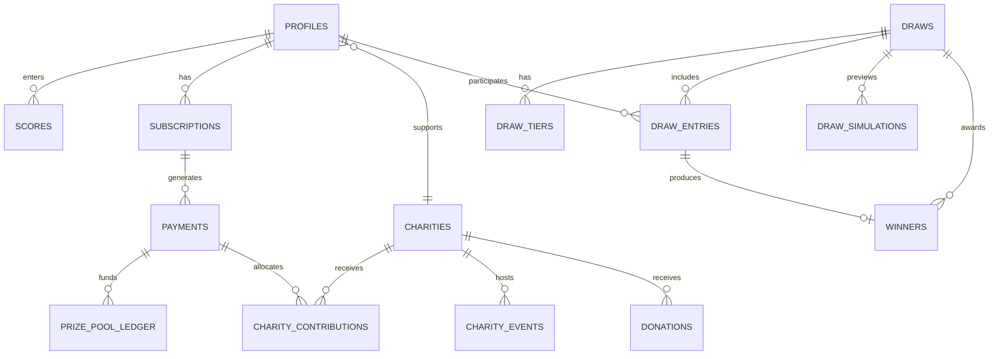

# Digital Heroes: Full-Stack Implementation Plan

> **Source:** Digital Heroes PRD (Level 1), Version 1.0, March 2026, issued for selection process only.
> **Purpose of this file:** a build plan written to be handed to an AI coding agent. Follow the PRD requirements exactly as stated in the "PRD Ground Truth" section. Where the PRD is ambiguous, use the declared assumptions (A1 to A10) and record them in the project README.

---

## How the AI Agent Should Use This Document

1. Treat **Section 0.1 (PRD Ground Truth)** as immutable. Never change a number, label, state name, or rule listed there.
2. Where the PRD is silent, use the **Assumptions table (0.3)**. Do not invent new behaviour without adding a numbered assumption to the README.
3. Build in the order of **Section 4 (Phased Plan)**. Each feature slice includes DB, API, UI, and tests.
4. Put all business rules (score rolling, prize math, draw engine) in pure, unit-tested TypeScript modules under `/lib/domain`, and enforce critical invariants again in Postgres (constraints, functions, transactions).
5. Money is always stored as **integers** (smallest currency unit). Never use floats for money.
6. Every phase ends with the matching items from the PRD testing checklist (Section 0.1, item 12) passing.

---

## 0. PRD Analysis: Ground Truth, Gaps, Assumptions

### 0.1 PRD Ground Truth (do not alter)

**1. Platform (§01).** A subscription-driven web application combining golf performance tracking, charity fundraising, and a monthly draw-based reward engine. It must feel emotionally engaging and modern, deliberately avoiding the aesthetics of a traditional golf website.

**What users do (§01.1):**
- Subscribe to the platform (monthly or yearly)
- Enter their latest golf scores in Stableford format
- Participate in monthly draw-based prize pools
- Support a charity of their choice with a portion of their subscription

**2. Core objectives (§02), six in total:**

| Tag | Objective |
|---|---|
| Engine | Subscription: build a robust subscription and payment system |
| Experience | Score entry: simple, engaging score-entry flow |
| Engine | Custom draw: algorithm-powered or random monthly draws |
| Integration | Charity: seamless charity contribution logic |
| Control | Admin: comprehensive admin dashboard and tools |
| Design | Outstanding UI/UX: a look that stands out in the golf industry |

**3. User roles (§03), three roles:**

| Role | Capabilities |
|---|---|
| Public visitor | View platform concept; explore listed charities; understand draw mechanics; initiate subscription |
| Registered subscriber | Manage profile & settings; enter/edit golf scores; select charity recipient; view participation & winnings; upload winner proof |
| Administrator | Manage users & subscriptions; configure & run draws; manage charity listings; verify winners & payouts; access reports & analytics |

**4. Subscription & payment (§04):**
- **Plans:** monthly plan and yearly plan (discounted rate)
- **Gateway:** Stripe (or equivalent PCI-compliant provider)
- **Access control:** non-subscribers receive restricted access to platform features
- **Lifecycle:** handles renewal, cancellation, and lapsed-subscription states
- **Validation:** real-time subscription status check on every authenticated request

**5. Score management (§05):**
- Users must enter their last 5 golf scores
- Score range: 1 to 45 (Stableford format)
- Each score must include a date
- Only the latest 5 scores are retained at any time
- A new score replaces the oldest stored score automatically
- Scores display in reverse chronological order (most recent first)
- **Only one score entry is permitted per date.** Duplicate scores for the same date are not allowed. An existing entry may only be edited or deleted.

**6. Draw & reward system (§06):**
- **Draw types:** 5-number match, 4-number match, 3-number match
- **Draw logic:** Random (standard lottery-style) or Algorithmic (weighted by score frequency)
- **Operations:** monthly cadence; admin controls publishing; simulation before publish; jackpot rollover if unclaimed

**7. Prize pool logic (§07).** A fixed portion of each subscription contributes to the prize pool. Distribution is pre-defined and enforced automatically.

| Match type | Pool share | Rollover? |
|---|---|---|
| 5-Number match | 40% | Yes, jackpot |
| 4-Number match | 35% | No |
| 3-Number match | 25% | No |

- Auto-calculation of each pool tier based on active subscriber count
- Prizes split equally among multiple winners in the same tier
- 5-match jackpot carries forward if unclaimed

**8. Charity system (§08).** Charitable impact leads the platform's story. Every subscriber directs part of their fee to a cause they choose.
- **Contribution model (§08.1):** users select a charity at signup; **minimum contribution is 10% of the subscription fee**; users may voluntarily increase their charity percentage; independent donation option, not tied to gameplay
- **Directory features (§08.2):**
  - Discovery: charity listing page with search and filter
  - Detail: profiles with description, images, and upcoming events such as golf days
  - Homepage: featured charity section (spotlight)

**9. Winner verification (§09):**
- **Eligibility:** verification applies to winners only
- **Proof upload:** screenshot of scores from the golf platform
- **Admin review:** approve or reject submission
- **Payment states:** Pending → Paid

**10. User dashboard (§10).** Must include all of the following:
1. Subscription status: active / inactive / renewal date
2. Score entry and edit interface
3. Selected charity and contribution percentage
4. Participation summary: draws entered, upcoming draws
5. Winnings overview: total won and current payment status

**11. Admin dashboard (§11), five control surfaces:**

| # | Surface | Capabilities |
|---|---|---|
| 01 | User management | View and edit user profiles; edit golf scores; manage subscriptions |
| 02 | Draw management | Configure draw logic (random vs. algorithm); run simulations; publish results |
| 03 | Charity management | Add, edit, delete charities; manage content and media |
| 04 | Winners management | View full winners list; verify submissions; mark payouts as completed |
| 05 | Reports & analytics | Total users; total prize pool; charity contribution totals; draw statistics |

**UI/UX (§12):**
- **Feel:** clean, modern, motion-enhanced interface. Emotion-driven, leading with charitable impact, not sport.
- **Avoid:** golf clichés (fairways, plaid, club imagery as primary design language)
- **Homepage:** clearly communicates what the user does, how they win, charity impact, and the call to action
- **Animations:** subtle transitions and micro-interactions throughout
- **CTA:** subscribe button/flow must be prominent and persuasive

**Mandatory deliverables (§15):**

| Item | Requirement |
|---|---|
| Live website | Fully deployed, publicly accessible URL |
| User panel | Test credentials; signup / login / score entry / dashboard all functional |
| Admin panel | Admin credentials; user management, draw system, charities, winner verification |
| Database | Backend connected (e.g. Supabase) with proper schema |
| Source code | Clean, structured, well-commented codebase |

**Deployment constraints (§15.1):**
- Deploy to a **new** Vercel account (not personal/existing)
- Use a **new** Supabase project (not personal/existing)
- Environment variables must be properly configured

**Evaluation criteria (§16):** requirements interpretation; system design; UI/UX creativity; data handling (accuracy of score logic, draw engine, and prize calculations); scalability thinking; problem-solving (how ambiguous requirements are identified and resolved).

**12. Testing checklist (§16.1):**
- [ ] User signup & login
- [ ] Subscription flow (monthly and yearly)
- [ ] Score entry: 5-score rolling logic
- [ ] Draw system logic and simulation
- [ ] Charity selection and contribution calculation
- [ ] Winner verification flow and payout tracking
- [ ] User dashboard: all modules functional
- [ ] Admin panel: full control and usability
- [ ] Data accuracy across all modules
- [ ] Responsive design on mobile and desktop
- [ ] Error handling and edge cases

### 0.2 Gaps in the PRD itself

- The table of contents lists **§13 Technical requirements** and **§14 Scalability considerations** (page 11), but that page is **missing** from the supplied file. Tech requirements are inferred from §15 and §16. If possible, request the missing page from the issuer.
- The TOC says "sixteen sections," but the document also contains §17 (About this document). This is cosmetic.
- The PRD says "ambiguity is part of the test." Document every resolution below in the README.

### 0.3 Assumptions (declare all of these in the README)

| # | Ambiguity | Assumption |
|---|---|---|
| A1 | Draw number range is unspecified | Draw picks **5 distinct numbers from 1 to 45**, matching the Stableford range. A user's 5 stored scores are matched against them. |
| A2 | What "5/4/3-number match" means | Count of the user's **distinct score values** that appear in the 5 winning numbers. |
| A3 | Prize pool % per subscription is "fixed" but not given | Stored as a config value (`prize_pool_pct`, default 50%). Admin-editable and snapshotted per payment. |
| A4 | Yearly subscribers and monthly pools | A yearly payment's pool share is **amortised 1/12 per month** across 12 monthly pools. |
| A5 | Who is draw-eligible | Users with `active` subscription status **and exactly 5 scores** at draw time. |
| A6 | "Latest 5" when backdating | Retention is by `score_date`, not insert time. If a new entry is older than all 5 existing scores, it is rejected with a clear message. |
| A7 | Algorithmic "weighted by score frequency" | Weighted random sampling using score frequency across all eligible users. Admin can choose `most_frequent` or `least_frequent` bias. |
| A8 | Verification vs payment | Two independent state machines. Verification: `pending_proof → submitted → approved / rejected`. Payment: `pending → paid`. Payment can only become `paid` after `approved`. |
| A9 | Multiple winners in a tier | Tier pool split equally, rounded **down** to the smallest currency unit. The remainder stays with the platform, except in the 5-match tier, where it rolls over. |
| A10 | Currency | INR, stored as integer paise, configurable. |

---

## 1. Architecture & Tech Stack

The PRD names Supabase and Vercel and allows "Stripe or equivalent," so the stack aligns to those.

| Layer | Choice | Rationale |
|---|---|---|
| Framework | **Next.js 15 (App Router) + TypeScript (strict)** | One deployable for UI and API on Vercel. Server Components, route handlers, and middleware for auth and subscription gating. |
| UI | **Tailwind CSS + shadcn/ui + Framer Motion** | Fast, accessible, and motion-enhanced (§12). Custom design tokens keep it from looking like a golf site. |
| Forms / validation | **React Hook Form + Zod** | Zod schemas shared between client and server so rules exist once (score 1 to 45, charity % ≥ 10). |
| Database | **Supabase Postgres** | Required by §15.1 (new project). Use constraints, RLS, and SQL functions for critical invariants. |
| Auth | **Supabase Auth** (email/password, session cookies via `@supabase/ssr`) | Signup and login. Role stored in `profiles.role`. |
| File storage | **Supabase Storage**: private bucket `winner-proofs`, public bucket `charity-media` | Winner screenshot uploads and charity images. |
| Payments | **Stripe** (Checkout + Customer Portal + Webhooks) | PCI-compliant hosted flow. Handles renewal, cancellation, and lapse. |
| Hosting | **Vercel** (new account) | Required by §15.1. |
| Testing | **Vitest** (unit), **Playwright** (E2E), **pgTAP or SQL tests** (RLS / functions) | Maps to the §16.1 checklist. |
| CI/CD | **GitHub Actions**: lint, typecheck, test, Vercel preview | |
| Optional | Resend (transactional email), Sentry (errors) | Not in the PRD. |

### Architecture principles

1. **Business rules in one place.** Score rolling, prize math, and the draw engine are pure TypeScript modules in `/lib/domain` with no I/O, so they are unit-testable and seedable. Critical writes (score insert, draw publish) also execute inside Postgres functions/transactions.
2. **Stripe webhook is the source of truth** for subscription state. The DB mirrors it.
3. **Real-time status check on every authenticated request** (§04). Middleware plus a server helper `requireActiveSubscriber()` read the DB row and never trust the JWT alone.
4. **Money as integers**, and every financial event is written to an append-only ledger.

### Suggested repo structure

```
/app
  (public)/        page.tsx, charities/, charities/[slug], how-it-works, subscribe
  (auth)/          login, signup
  (subscriber)/dashboard/   scores, charity, draws, winnings
  (admin)/admin/   users, draws, charities, winners, reports
  api/             route handlers
/lib
  domain/          scores.ts, draw-engine.ts, prize-pool.ts, charity-split.ts
  supabase/        server.ts, client.ts, admin.ts
  stripe/          client.ts, webhook-handlers.ts
  validation/      *.schema.ts
/supabase          migrations/, seed.sql
/tests             unit/, e2e/
```

### Environment variables

```
NEXT_PUBLIC_SUPABASE_URL
NEXT_PUBLIC_SUPABASE_ANON_KEY
SUPABASE_SERVICE_ROLE_KEY      # server only
STRIPE_SECRET_KEY
STRIPE_WEBHOOK_SECRET
STRIPE_PRICE_MONTHLY
STRIPE_PRICE_YEARLY
NEXT_PUBLIC_SITE_URL
```

Provide a `.env.example` and configure all variables in Vercel for Preview and Production (§15.1).

---

## 2. High-Level Data Model



| Table | Key attributes | Notes / constraints |
|---|---|---|
| `profiles` | `id` (= auth.users.id), `email`, `full_name`, `role` (`subscriber` / `admin`), `charity_id` FK, `charity_percent`, `created_at` | `charity_percent` CHECK **≥ 10 AND ≤ 100**. Charity chosen at signup (§08.1). The public visitor is an unauthenticated session and has no row. |
| `subscriptions` | `id`, `user_id`, `plan` (`monthly` / `yearly`), `status` (`active` / `past_due` / `cancelled` / `lapsed` / `inactive`), `stripe_customer_id`, `stripe_subscription_id`, `current_period_start`, `current_period_end`, `cancel_at_period_end` | Covers active/inactive/renewal date (§10) and the lifecycle in §04. |
| `payments` | `id`, `subscription_id`, `user_id`, `stripe_invoice_id` UNIQUE, `gross_amount`, `currency`, `prize_pool_amount`, `charity_amount`, `charity_percent_applied`, `platform_amount`, `paid_at` | Snapshots the split at payment time, so later config changes never rewrite history. |
| `prize_pool_ledger` | `id`, `payment_id`, `draw_month` (date), `amount` | 1 row for monthly plans, 12 for yearly (A4). Pool = SUM per month. |
| `scores` | `id`, `user_id`, `score_date` (date), `stableford_score` smallint, timestamps | CHECK `1..45`. **UNIQUE(user_id, score_date)** (§05). |
| `charities` | `id`, `name`, `slug`, `description`, `image_urls[]`, `is_featured`, `is_active` | Directory, profile, and homepage spotlight. |
| `charity_events` | `id`, `charity_id`, `title`, `event_date`, `location`, `description` | "Upcoming events such as golf days." |
| `charity_contributions` | `id`, `user_id`, `charity_id`, `payment_id`, `amount`, `percent` | Ledger for reports. |
| `donations` | `id`, `user_id` (nullable), `charity_id`, `amount`, `stripe_payment_intent_id`, `status` | Independent, not tied to gameplay (§08.1). |
| `draws` | `id`, `draw_month` UNIQUE, `mode` (`random` / `algorithmic`), `status` (`draft` / `simulated` / `published`), `winning_numbers` smallint[5], `active_subscriber_count`, `pool_total`, `jackpot_carried_in`, `published_at`, `published_by`, `config` jsonb | Monthly cadence, admin-controlled publishing. |
| `draw_tiers` | `id`, `draw_id`, `match_type` (5 / 4 / 3), `share_pct` (40 / 35 / 25), `tier_pool`, `rollover_in`, `winners_count`, `per_winner_amount`, `rolled_over_out` | Rollover applies **only** to 5-match. |
| `draw_entries` | `id`, `draw_id`, `user_id`, `scores_snapshot` smallint[], `matched_count`, `tier` | UNIQUE(draw_id, user_id). The snapshot makes the draw auditable. |
| `draw_simulations` | `id`, `draw_id`, `mode`, `numbers`, `result` jsonb, `created_by`, `created_at` | Simulation before publish. Never affects real tables. |
| `winners` | `id`, `draw_id`, `user_id`, `draw_entry_id`, `match_type`, `prize_amount`, `verification_status`, `proof_path`, `admin_notes`, `reviewed_by`, `reviewed_at`, `payment_status` (`pending` / `paid`), `paid_at` | Two state machines (A8). |
| `platform_settings` | `key`, `value` jsonb | Plan prices, yearly discount, `prize_pool_pct`, `min_charity_percent` = 10, tier shares (40/35/25), number range. |
| `audit_log` | `id`, `actor_id`, `action`, `entity`, `entity_id`, `diff`, `created_at` | All admin mutations. |

**Security:** RLS on every table. Subscribers can read and write only their own rows. Admins are identified through an `is_admin()` SQL function. Draw tables and the ledger are written only by the service role.

---

## 3. Core API Endpoints

All routes validate with Zod and return `{ data }` or `{ error: { code, message } }`. "Sub" means an active subscription is required and is checked live against the database.

### Public

| Method | Route | Description |
|---|---|---|
| GET | `/api/charities?search=&category=` | Directory with search and filter |
| GET | `/api/charities/:slug` | Profile with description, images, upcoming events |
| GET | `/api/charities/featured` | Homepage spotlight |
| GET | `/api/draws/latest` | Latest published draw's numbers and prize summary (draw mechanics) |
| POST | `/api/donations/checkout` | Independent donation. Body: `{charityId, amount}`. Returns a Stripe session URL. |

### Auth & profile

| Method | Route | Description |
|---|---|---|
| POST | `/api/auth/signup` | `{email, password, fullName, charityId, charityPercent ≥ 10}` |
| POST | `/api/auth/login`, `/api/auth/logout` | Session handling |
| GET / PATCH | `/api/me` | Profile and settings |
| PATCH | `/api/me/charity` | `{charityId, charityPercent}` (min 10%) |

### Subscription

| Method | Route | Description |
|---|---|---|
| POST | `/api/subscriptions/checkout` | `{plan: "monthly" or "yearly"}`. Returns a Stripe Checkout URL. |
| POST | `/api/subscriptions/portal` | Stripe Customer Portal (cancel and update) |
| GET | `/api/subscriptions/me` | Status, plan, renewal date |
| POST | `/api/webhooks/stripe` | Signature-verified and idempotent. Handles `checkout.session.completed`, `invoice.paid`, `invoice.payment_failed`, `customer.subscription.updated`, `customer.subscription.deleted`. |

### Scores (Sub)

| Method | Route | Description |
|---|---|---|
| GET | `/api/scores` | Latest 5, reverse chronological |
| POST | `/api/scores` | `{score_date, score 1 to 45}`. Rejects a duplicate date (409). Trims to 5 in one transaction. |
| PATCH | `/api/scores/:id` | Edit score and/or date (date still unique) |
| DELETE | `/api/scores/:id` | Delete |

### Dashboard & winnings (Sub)

| Method | Route | Description |
|---|---|---|
| GET | `/api/dashboard` | Aggregate: subscription, scores, charity and %, draws entered, upcoming draw, winnings total and payment status |
| GET | `/api/winnings` | My wins with verification and payment states |
| POST | `/api/winners/:id/proof` | Upload screenshot (multipart, size and type validated) |

### Admin (role = admin)

| Method | Route | Description |
|---|---|---|
| GET / PATCH | `/api/admin/users`, `/api/admin/users/:id` | View and edit profiles |
| PUT | `/api/admin/users/:id/scores/:scoreId` | Edit a user's scores |
| PATCH | `/api/admin/users/:id/subscription` | Manage subscription (status override, cancel) |
| POST | `/api/admin/draws` | Create the monthly draw `{month, mode, config}` |
| POST | `/api/admin/draws/:id/simulate` | Dry run. Returns numbers, winners per tier, and payouts. Writes nothing real. |
| POST | `/api/admin/draws/:id/publish` | Finalise: entries, tiers, winners, rollover. Idempotent and status-guarded. |
| GET | `/api/admin/draws`, `/api/admin/draws/:id` | List and detail |
| POST / PATCH / DELETE | `/api/admin/charities`, `/api/admin/charities/:id` | Charity CRUD plus media upload and events |
| GET | `/api/admin/winners` | Full winners list with filters |
| PATCH | `/api/admin/winners/:id/verify` | `{decision: "approve" or "reject", notes}` |
| PATCH | `/api/admin/winners/:id/payout` | Mark `paid` (only if approved) |
| GET | `/api/admin/reports` | Total users, total prize pool, charity contribution totals, draw statistics |

---

## 4. Phased Implementation Plan

### Phase 1: Setup, Infrastructure & CI/CD

**Backend / Infra**
- [ ] Create a **new Vercel account and project** and a **new Supabase project** (§15.1). Do not reuse personal ones.
- [ ] Create a Stripe account in test mode with monthly and yearly Prices (yearly discounted).
- [ ] Initialise the Supabase CLI, migrations folder, and seed script.
- [ ] Configure env vars in Vercel for Preview and Production. Add `.env.example`.
- [ ] Set up a Stripe webhook endpoint and local testing with `stripe listen`.

**Frontend / Repo**
- [ ] Scaffold Next.js with TypeScript strict mode, Tailwind, shadcn/ui, Framer Motion, ESLint, Prettier, Husky.
- [ ] Define design tokens (palette, type scale, motion durations) for a **charity-first, non-golf** look (§12).
- [ ] GitHub Actions: lint, typecheck, unit tests, and Vercel previews on every PR.

**Exit criteria:** empty app deploys to the new Vercel project, connects to the new Supabase project, and CI is green.

### Phase 2: Database & Core Backend

**Backend**
- [ ] Write migrations for all tables in Section 2, with constraints: score 1 to 45, UNIQUE(user, date), charity % ≥ 10, and enums.
- [ ] Write RLS policies plus `is_admin()`. Add the private and public storage buckets with policies.
- [ ] Implement the SQL function `add_score(user, date, score)` in one transaction: lock the user row, reject a duplicate date, insert, and delete rows beyond the 5 newest by date.
- [ ] Implement Supabase Auth flows and a trigger that creates `profiles` on signup.
- [ ] Build the middleware and `requireActiveSubscriber()` and `requireAdmin()` helpers with a live DB status check.
- [ ] Build the Stripe webhook handler, idempotent by `stripe_invoice_id`. On `invoice.paid`, write `payments`, `prize_pool_ledger` (1 or 12 rows), and `charity_contributions`. Handle failure, cancel, and lapse.
- [ ] Implement pure domain modules with tests: `charity-split`, `prize-pool`, `draw-engine` (random and weighted, with a seedable RNG), and `tier-payouts` (equal split, floor rounding, jackpot rollover).
- [ ] Seed: admin user, test subscriber, 6+ charities, sample scores.

**Exit criteria:** domain unit tests pass; RLS verified; webhook handles a full Stripe test lifecycle.

### Phase 3: Frontend Foundation & API Integration

**Frontend**
- [ ] Global layout, navigation, and auth-aware header. Route groups for public, subscriber, and admin.
- [ ] Auth pages. Signup includes charity selection and a percent slider with a 10% minimum.
- [ ] Typed API client and shared Zod schemas. Data fetching with TanStack Query or server actions.
- [ ] Shared components: buttons, cards, form fields, toasts, skeleton loaders, error boundaries, empty states.
- [ ] Route guards: subscriber pages show a persuasive "Subscribe to unlock" state for non-subscribers (restricted access, §04).

**Backend**
- [ ] Wire the route handlers to the domain modules and add a consistent error format.
- [ ] Add rate limiting on auth, upload, and donation routes.

**Exit criteria:** signup, login, logout, and role-based routing work end to end.

### Phase 4: Feature Implementation (Iterative)

Deliver in vertical slices. Each slice covers DB, API, UI, and tests.

**Slice 1. Subscription & payments**
- FE: plan selection UI (monthly vs yearly with the savings shown), status badge, renewal date.
- BE: Stripe Checkout, webhook-driven status, Customer Portal for cancel, lapsed and renewal states.

**Slice 2. Score management**
- FE: entry form (date picker and 1 to 45 input), list in reverse chronological order, edit and delete, duplicate-date error messaging.
- BE: `add_score` function and CRUD routes.

**Slice 3. Charity system**
- FE: directory with search and filter, profile pages (description, images, events), homepage spotlight, charity-percent control (min 10%), independent donation flow.
- BE: CRUD, contribution ledger, donation checkout.

**Slice 4. Draw engine**
- BE: eligibility query (A5), random and algorithmic generators, entry snapshots, match counting, tier payouts (40/35/25), jackpot rollover, `simulate` (no writes) versus `publish` (transactional and idempotent).
- FE (admin): configure mode, run a simulation, review the result, then publish.

**Slice 5. Winner verification**
- FE (subscriber): proof upload (screenshot of scores) and status tracker.
- FE (admin): review queue with approve/reject and a "mark paid" action.
- BE: the two state machines (A8), signed URLs for private proofs, audit log.

**Slice 6. User dashboard.** All five required modules:
1. Subscription status / renewal date
2. Score entry and edit
3. Selected charity and contribution percentage
4. Participation summary (draws entered, upcoming draws)
5. Winnings overview (total won and current payment status)

**Slice 7. Admin dashboard.** Five surfaces:
1. Users: view/edit profiles, edit scores, manage subscriptions
2. Draws: configure logic (random vs algorithm), run simulations, publish results
3. Charities: add/edit/delete plus content and media
4. Winners: full list, verify submissions, mark payouts completed
5. Reports & analytics: total users, total prize pool, charity contribution totals, draw statistics

**Slice 8. Homepage and UI polish**
- Homepage clearly shows what the user does, how they win, the charity impact, and a prominent subscribe CTA.
- Subtle transitions and micro-interactions throughout.
- Avoid golf clichés (fairways, plaid, clubs as the primary design language).
- Fully responsive on mobile and desktop.

### Phase 5: Testing, QA, and Production Deployment

- [ ] **Unit tests:** score rolling (6th score evicts the oldest), duplicate date, boundaries 0/1/45/46, prize split with remainders, rollover chains, charity % validation.
- [ ] **DB tests:** RLS (user A cannot read user B), constraint violations, concurrent `add_score` race.
- [ ] **E2E (Playwright)** mapped one-to-one to the §16.1 checklist: signup/login, subscription (monthly and yearly with Stripe test cards), 5-score rolling, draw and simulation, charity selection and contribution math, winner verification and payout tracking, all dashboard modules, admin control, data accuracy, responsive layouts, error handling and edge cases.
- [ ] **Deploy:** run migrations on the new production Supabase project, set production env vars, register the production Stripe webhook, and smoke test.
- [ ] **Deliverables (§15):** live URL, **test user credentials**, **admin credentials**, connected database with schema, clean and commented codebase. README lists assumptions A1 to A10.

---

## 5. Potential Risks & Edge Cases

| Risk | Mitigation |
|---|---|
| **Concurrent score inserts** break the "exactly 5" rule | One Postgres transaction with a per-user lock, plus a UNIQUE constraint as backstop. |
| **Backdated score older than all 5** (A6) | Reject with a clear message, or accept and immediately evict. Document the choice. |
| **Editing a score's date to a duplicate** | UNIQUE constraint returns 409 with friendly UI copy. |
| **Score edits after a draw is published** | Draw entries use `scores_snapshot`, so results are immutable. |
| **Duplicate Stripe webhooks or out-of-order events** | Idempotency keys (`stripe_invoice_id`, event ID table) and state derived from the latest Stripe object. |
| **Stale subscription status** (PRD requires real-time checks) | Live DB read per authenticated request. Optionally cache for a few seconds only, and always invalidate on webhook. |
| **Privilege escalation** | Role lives only in `profiles`, is not user-writable (RLS), and the service-role key stays server-only. |
| **Winner proof privacy** | Private bucket, MIME and size validation, short-lived signed URLs for admin viewing only. |
| **Double publish or race on publishing** | Status guard `simulated → published` with `SELECT … FOR UPDATE` and UNIQUE(draw_month). |
| **Rounding and money drift** | Integer paise, floor division, remainder policy (A9). Reconcile: sum of tier payouts + rollover ≤ pool. |
| **Jackpot rollover chain** | Store `jackpot_carried_in` and `rolled_over_out` per draw. Test multi-month chains. |
| **No winners or no eligible subscribers** | Draw still publishes cleanly. The 5-match tier rolls forward. |
| **Yearly plan pool timing** | 1/12 amortised ledger (A4). If a yearly user cancels or is refunded, define whether remaining months are reversed. |
| **Charity % changed mid-cycle** | Snapshot the percent per payment. Changes apply from the next payment. |
| **Refunds and chargebacks** | Handle `charge.refunded` and dispute events by reversing ledger rows. |
| **Lapsed user with a pending prize** | Prizes stay claimable, since they were earned while active. Document this. |
| **Fraudulent proof screenshots** | Admin reviews against the stored `scores_snapshot`. Keep the audit log. |
| **Time zones** | Store `score_date` as DATE. Define draw month boundaries in one canonical zone (e.g., Asia/Kolkata). |
| **Draw compute at scale** | Do matching set-based in SQL (or batched), not row-by-row in Node. Index `scores(user_id, score_date)` and `subscriptions(status)`. |
| **Algorithmic draw bias or predictability** | Keep it seedable. Log the seed and config in `draws.config` for auditability. |
| **Vercel serverless timeouts on big draws** | Run publish as a Postgres function, or a chunked background job if user count grows. |
| **Extensibility** (§16 "Scalability thinking") | Tier shares, pool %, plan prices, and number range live in `platform_settings`. Draw modes sit behind a strategy interface so adding a mode doesn't touch the publish flow. |

---

## 6. Definition of Done

- Every item in the PRD testing checklist (Section 0.1, item 12) passes in E2E tests.
- All mandatory deliverables (§15) are ready: live URL, user credentials, admin credentials, connected schema, clean commented code.
- Deployment uses a **new** Vercel account and a **new** Supabase project, with environment variables configured.
- README documents assumptions A1 to A10 and the gap in the PRD (missing §13 and §14 page).
